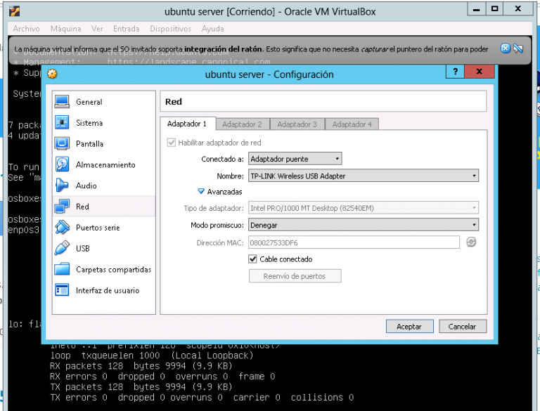

# Configuración de IP fija en Ubuntu Server:

* Configuramos el adaptador de red e iniciamos sistema.

<kbd>

</kbd>

* Ejecutamos "ifconfig" y vemos la ip que tenemos configurada.
* Ela ruta "/etc/net/netplan/ y editamos el archivo de configuración de esta carpeta, dejando algo así:
```bash
network:
  ethernets:
    ens160:
      addresses:
      - 10.10.20.6/24
      - 2001:678:e20:20::6/64
      nameservers:
        addresses:
        - 10.10.20.71
      routes:
          - to: default
            via: 10.10.20.1
          - to: default
            via: 2001:678:e20:20::1
  version: 2
  ```
  ** Ojo muy importante tabulaciones y espacios en blanco