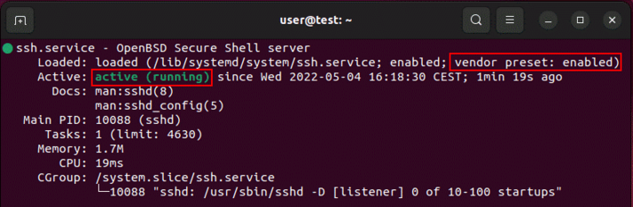

# Configuración de ssh en Ubuntu
* En caso de que no hayamos intalado ssh al instlar el sistema operativo
```bash
sudo apt install openssh-server
```
* Verificar estado de ssh
```bash
sudo systemctl status ssh
```
* Debemos ver algo así:

<kbd>
    
</kbd>


* Si el servidor sigue inactivo:
```bash
sudo systemctl enable ssh
sudo systemctl start ssh
```

*  Fichero de configuración: sudo nano "/etc/ssh/sshd_config"